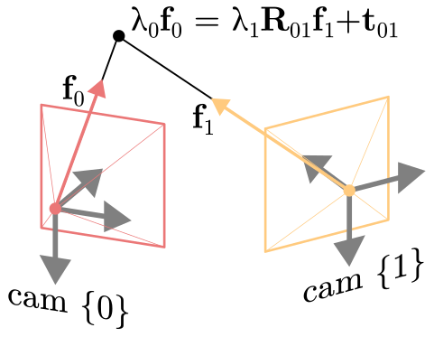

<div align="center">
    <h1>From Correspondences to Pose:<br>Non-minimal Certifiably Optimal Relative Pose<br>without Disambiguation</h1>
    <p>Javier Tirado-Garín &emsp;&emsp; Javier Civera<br>
    I3A, University of Zaragoza</p>
    
    <p><strong>Relative pose directly from matches, without additional steps for disambiguation and pure rotation checks.</strong></p>
    <p><a href="TODO-link">arXiv</a></p>
</div>

## Installation

For ease of installation, we recommend installing the package via PyPi. We provide wheels for Linux, MacOS, and Windows, which also install the necessary Python bindings for the Semidefinite Programming (SDP) solver [SDPA](https://sdpa.sourceforge.net/). The project can be installed by executing:
```shell
pip install nonmin-pose
```

## Usage

### C2P and C2P-fast

Instances of C2P and C2P-fast can be created as follows:
```python
from nonmin_pose import C2P, C2PFast

configuration = {
    # threshold for the singular values of X to check if rank(X)\in[1,3] (condition for tightness),
    # where X is the SDP-solution submatrix corresponding to E, t, q and h.
    "th_rank_optimality": 1e-5,  # default
    # threshold for the slack variable "st" for detecting (near-)pure rotations.
    "th_pure_rot_sdp": 1e-3,  # default
    # threshold for "st" used for detecting noise-free pure rotations
    # and improving the numerical accuracy.
    "th_pure_rot_noisefree_sdp": 1e-4,  # default
}

solver = C2P(cfg=configuration)
solver_fast = C2PFast(cfg=configuration)
```

Given a set of `n` correspondences (pairs of unit bearing vectors), represented as two numpy ndarrays, `f0` and `f1`, each of shape `(3, n)`, all solvers can be called and the solution estimates can be recovered as follows:

```python
solution = solver(f0, f1)

# essential matrix
E01 = solution["E01"]
# relative rotation and translation
R01 = solution["R01"]
t01 = solution["t01"]
# certificate
is_optimal = solution["is_optimal"]
# pure rotation check
is_pure_rot = solution["is_pure_rot"]
```

<details>
<summary> [Click to see docstring and optional arguments] </summary>

```python
"""Non-minimal relative pose estimation.

Args:
    f0: (3, n) bearing vectors in camera 0.
    f1: (3, n) bearing vectors in camera 1.
    w: (n,) array of weights for each residual. (default: None).
    already_unitary: True if the input coordinates are already unitary
        (default: False).
    do_disambiguation: True to decompose the essential matrix into relative
        rotation and translation. This argument is ignored when using C2P and is
        only used for the essential matrix solvers of Zhao and Garcia-Salguero.
        (default: True).

Returns:
    sol: dict of solution parameters, with keys and values:
        - E01: (3, 3) essential matrix.
        - R01: (3, 3) rotation matrix. It is not returned for the methods of
            Zhao and G.Salguero et al. if do_disambiguation is False.
        - t01: (3, 1) translation vector. It is not returned for the methods of
            Zhao and G.Salguero et al. if do_disambiguation is False.
        - is_optimal: True if the solution is optimal.
        - is_pure_rot: True if a (near-)pure rotation is detected. It is not
            returned for the methods of Zhao and G.Salguero et al. if
            do_disambiguation is False.
"""
```

</details>

#### Notation used in the code


* (Algebraic) Epipolar errors are defined as  
```math
\mathbf{f}_{0}^{\top} \mathbf{E}_{01} \mathbf{f}_1
```  
* The relative rotation and translation, $\mathbf{R} _{01}$ and $\mathbf{t} _{01}$, map a 3D point expressed in cam {1} to cam {0} as  
```math
\lambda_0 \mathbf{f}_0 = \lambda_1 \mathbf{R}_{01} \mathbf{f}_1 + \mathbf{t}_{01}
```  
where $\lambda_0,\lambda_1\in\mathbb{R}$ represent the norm of the 3D point when expressed in cam {1} and cam {0}, respectively.


### Zhao's [[2]](#2) and García-Salguero et al.'s [[3]](#3) methods

We also provide Python classes for the methods of J. Zhao [[2]](#2) and M. García-Salguero et al. [[3]](#3), which can be instantiated as follows:
```python
from nonmin_pose import EssentialZhao, EssentialGSalguero

configuration = {
    # threshold on the singular values of of the diagonal blocks of X, with X the SDP-solution, to check if they are rank-1 (condition for tightness).
    "th_rank_optimality": 1e-5,  # default
    # threshold for the posterior step used for detecting (near-)pure rotations.
    "th_pure_rot_post": 1 - 1e-8,  # default
}

solver = EssentialZhao(cfg=configuration)
solver = EssentialGSalguero(cfg=configuration)
```

## Evaluation

To reproduce the experiments reported in the paper, please first clone the repository
```shell
git clone https://github.com/javrtg/C2P.git
cd C2P/experiments
```
and then install the [dependencies](experiments/env_experiments.yml), e.g. using conda:
```shell
conda env create -f env_experiments.yml
conda activate c2p_exp
```

Finally, run the following commands depending on the experiment to be reproduced. All results will be automatically stored under a subfolder named `results`.

#### Accuracy vs number of correspondences

```shell
python accuracy_vs_npoints.py
```

#### Accuracy vs noise levels

```shell
python accuracy_vs_noise.py
```

#### Accuracy vs translation magnitude

```shell
python accuracy_vs_translation_length.py
```

#### Runtimes

```shell
python runtimes.py
```

#### Real-data experiment

For running this experiment, the official Python bindings of [`OpenGV`](https://laurentkneip.github.io/opengv/) are needed. Please follow the [installation guide](https://laurentkneip.github.io/opengv/page_installation.html) to install the library. Please place the resulting `.so` or `.pyd` under the `Lib/site-packages/pyopengv` folder of your python distribution along an `__init__.py` file similar to
```python
# __init__.py under Lib/site-packages/pyopengv
from . import pyopengv
```
This way, `pyopengv` can be imported from anywhere as
```python
from pyopengv import pyopengv
```

<details>
<summary> [Installation details if using Windows] </summary>

On Windows, installing the library with Visual Studio may be very slow. In case this becomes a problem, below we describe a potentially faster alternative by using the **MinGW64** toolchain. 

MinGW64 provides gcc, making the compilation process akin to a Linux environment. We detail below the steps to install the toolchain and build (py)opengv from source.
> :warning: Warning  
> There is a specific issue that needs to be solved first. OpenGV defines `struct timeval` and `gettimeofday` for Windows systems since they are native only to UNIX-like systems. Since MinGW already provides these, conflicts can occur during the build process. To prevent this, we need to modify L33 in [test/time_measurement.cpp](https://github.com/laurentkneip/opengv/blob/91f4b19c73450833a40e463ad3648aae80b3a7f3/test/time_measurement.cpp#L33) and L37 in [test/time_measurement.hpp](https://github.com/laurentkneip/opengv/blob/91f4b19c73450833a40e463ad3648aae80b3a7f3/test/time_measurement.hpp#L37) to change in both:
> ```c++
> #ifdef WIN32
> ```
> to
> ```c++
> #if defined(WIN32) && !defined(__MINGW32__)
> ```

<details>
<summary> 

### Setting up MinGW64 toolchain via MSYS2 

</summary>

To install the MinGW64 toolchain, a recommended approach is to first install [MSYS2](https://www.msys2.org/). MSYS2 comes with a package manager, `pacman`, useful for installing and managing additional dependencies like `cmake` and `eigen`. Alternatively, we can install these dependencies using other methods, such as within a [conda](https://docs.conda.io/projects/miniconda/en/latest/miniconda-install.html) or [mamba](https://mamba.readthedocs.io/en/latest/mamba-installation.html#mamba-install) environment.

following [MSYS2 docs](https://www.msys2.org/docs/updating/), after installing MSYS2, we need to launch the `MSYS2 MSYS` shell and update the package database by running:
```shell
pacman -Suy
```
As the [docs](https://www.msys2.org/docs/updating/) say, we may be prompted to close all terminals if core packages are updated: 
```shell
:: To complete this update all MSYS2 processes including this terminal will be closed.
   Confirm to proceed [Y/n]
```
If prompted, we need to close the terminal, reopen it, and run `pacman -Suy` again to update remaining packages.

Next, we need to install the `gcc` and `g++` compilers using:
```shell
pacman -S --needed base-devel mingw-w64-x86_64-toolchain
```
</details>

<details>
<summary> 

### Installing dependencies

</summary> 

Just as an example, below it is explained how to install the dependencies on a conda/mamba environment, but there are other alternatives, such as installing them in the `MSYS2 MSYS` shell.

Open a conda prompt and run the following commands:
```cmd
# create fresh environment to build opengv (replace 3.10 to the desired python version).
(base) C:\random\path> mamba create -n opengv python=3.10 cmake ninja eigen -y

# activate the new environment
(base) C:\random\path> mamba activate opengv
(opengv) C:\random\path> 
```

</details>

<details>
<summary> 

### Building OpenGV

</summary> 

First, to have access to the compilers, we need to add the MINGW64 binaries directory to the the `PATH` environment variable. If MSYS2 was installed using default options, this directory is typically `C:\msys64\mingw64\bin`. 
We can temporarily modify the `PATH` variable as follows:
```cmd
(opengv) C:\random\path> set PATH=%PATH%;C:\msys64\mingw64\bin
```

Finally, to build OpenGV:
```cmd
# navigate to the cloned opengv repository.
(opengv) C:\random\path> cd  \path\to\opengv

# create build directory.
(opengv) \path\to\opengv> mkdir build && cd build

# Build using cmake and ninja (adjust flags as needed):
(opengv) \path\to\opengv> cmake -G Ninja .. -DCMAKE_BUILD_TYPE=Release -DBUILD_TESTS=OFF -DBUILD_PYTHON=ON && ninja
```
</details>

The build process should take ~3 mins and the resulting compiled libraries will be stored in the folder `\path\to\opengv\build\lib`. 

> :warning: Warning  
> Since the Python extension isn't statically compiled, the compiled `.pyd` module (e.g. `pyopengv.cp310-win_amd64.pyd`) will rely on several MinGW `.dll` files at runtime. Thus, before importing `pyopengv`, we need to add the MinGW binaries directory to the DLL search path in Python. This can be done for for Python >= 3.8 as follows:
> ```python
> import os
> with os.add_dll_directory("C:\\msys64\\mingw64\\bin"):
>     import pyopengv
> ```
> Alternatively, and as mentioned earlier, to automate this, we can move the `.pyd` module to a manually created `pyopengv` folder within the `Lib/site-packages` directory of our Python interpreter. Inside this `pyopengv` folder, besides having  the `.pyd` file, we need to create a `__init__.py` file that contains something like:
> ```python
> import os
> from pathlib import Path
> 
> # constant for MinGW64 directory path.
> MINGW64_PATH = Path("C:\\msys64\\mingw64\\bin")
> 
> 
> def import_pyopengv():
>     """Import pyopengv, with optional modification to DLL search path."""
>     try:
>         # check if the MinGW64 directory exists
>         if MINGW64_PATH.is_dir():
>             # augment .dll search path to include MinGW64's bin directory.
>             with os.add_dll_directory(str(MINGW64_PATH)):
>                 from . import pyopengv
>         else:
>             from . import pyopengv
>         return pyopengv
>     except ImportError as e:
>         raise ImportError(f"Failed to import pyopengv: {e}")
> 
> 
> import_pyopengv()
> 
> # clean up the namespace.
> del os, Path, import_pyopengv, MINGW64_PATH
> ```
> After this, `pyopengv` can be imported, from any directory, as follows:
> ```python
> from pyopengv import pyopengv
> ```

</details>  

Finally, by executing the following command, the experiment will be run and when using the flag `--download`, the necessary data will be automatically downloaded and placed under the folder `experiments/data`.  
```shell
python experiments/real_data_strecha.py --download
```

## Build from source

[`SDPA`](https://sdpa.sourceforge.net/) is necessary to solve the SDP relaxation. We recommend following the [SDPA for Python installation guide](https://sdpa-python.github.io/docs/installation/) (without multiprecision requirements) which provides specific instructions for [Linux](https://sdpa-python.github.io/docs/installation/linux.html) | [Windows](https://sdpa-python.github.io/docs/installation/windows.html) | [MacOS](https://sdpa-python.github.io/docs/installation/macos.html). Please note that instead of using [SDPA-python](https://github.com/sdpa-python/sdpa-python), we have created thin bindings to the base SDPA's C++ library to gain more control over the solver's parameters. As such, the steps related to `sdpa-python` in the guide, can be safely skipped.

After installing SDPA, we need to compile the bindings. Please modify the global variables in [`setup.py`](setup.py) to match the library paths of your operating system. Then, the project can be installed in development mode by executing:
```shell
cd <path/to/C2P_repo>
pip install -e .
```

## Acknowledgements and license

This work is inspired by the following works:

[1] *A certifiably globally optimal solution to the non-minimal relative pose problem*, J. Briales, L. Kneip, J. Gonzalez-Jimenez, 2018 ([link](https://openaccess.thecvf.com/content_cvpr_2018/html/Briales_A_Certifiably_Globally_CVPR_2018_paper.html)).

<a id="2">[2]</a>
*An Efficient Solution to Non-Minimal Case Essential Matrix Estimation*, J. Zhao, 2022 ([link](https://arxiv.org/abs/1903.09067)).

<a id="3">[3]</a>
*A tighter relaxation for the relative pose problem between cameras*, M. García-Salguero, J. Briales, J. Gonzalez-Jimenez, 2022 ([link](https://link.springer.com/article/10.1007/s10851-022-01085-z)).


This work provides and uses python bindings to [SDPA](https://sdpa.sourceforge.net/):

[4] *Implementation and evaluation of SDPA 6.0 (SemiDefinite Programming Algorithm 6.0)*, M. Yamashita, K. Fujisawa, and M. Kojima, Optimization Methods and Software 18, 491-505, 2003.

[5] *A high-performance software package for semidefinite programs: SDPA 7*, M. Yamashita, K. Fujisawa, K. Nakata, M. Nakata, M. Fukuda, K. Kobayashi, and K. Goto, Research Report B-460 Dept. of Mathematical and Computing Science, Tokyo Institute of Technology, Tokyo, Japan, September, 2010.

SDPA is licensed under the [GNU Lesser General Public License v2.0](src/COPYING). As such this project is licensed under the [GNU Lesser General Public License v3.0](./LICENSE).


<!-- <table>
<tr>
<td>

```python
solution = solver(f0, f1)

# essential matrix
E01 = solution["E01"]
# relative rotation and translation
R01 = solution["R01"]
t01 = solution["t01"]
# certificate
is_optimal = solution["is_optimal"]
# pure rotation check
is_pure_rot = solution["is_pure_rot"]
```

</td>
<td align="center">

</td>
</tr>
<!-- <tr>
<td colspan="2">

**Notation used in the code**

(Algebraic) Epipolar errors are defined as:<br>

```math
\mathbf{f}_{0}^{\top} \mathbf{E}_{01} \mathbf{f}_1
```

The relative rotation and translation map a 3D point expressed in cam 1 to cam 0 as:<br>

```math
\lambda_0 \mathbf{f}_0 = \lambda_1 \mathbf{R}_{01} \mathbf{f}_1 + \mathbf{t}_{01}
```

where each lambda represents the norm of the 3D point when expressed in each camera.

</td>
</tr>
</table> -->


<!-- #### Optional arguments

By default, `f0` and `f1` will be be normalized to have unit norm along the `0` axis. If they are already unitary, to avoid this normalization, the optional argument `already_unitary=True` can be used:
```python
solution = solver(f0, f1, already_unitary=True)
```
For a detailed description of all optional parameters, please refer to the docstring of the solvers, which can be printed by executing `help(solver.__call__)`. -->